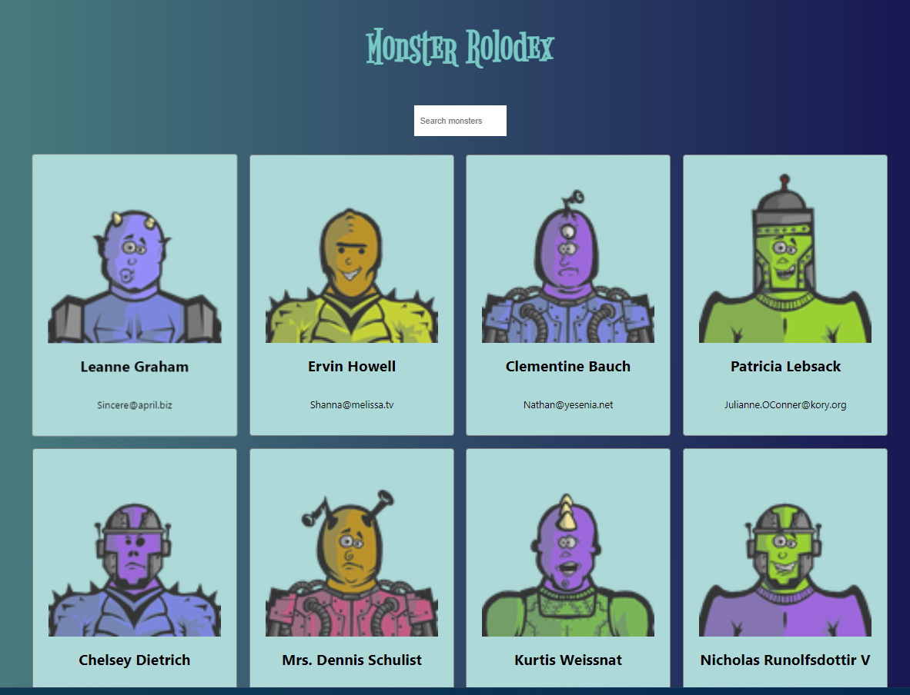

### Monster Rolodex

This is react project created for self learning.
- In this project I have learned to use 
  - hooks ( useEffect, useState)
  - Props, destructure
  - filter and Map function for array
- Project converted to typescript
  - type cast for promis base api call
  - <T> generic type 
  - search box have onchange event which is typed as ChangeEventHandler<HTMLInputElement>

import { ChangeEventHandler } from 'react';
```script
type SearchBoxProps = {
     className: string;
    placeholder?: string;
    onChangeHandler: ChangeEventHandler<HTMLInputElement>;
}
```
```script
<input
            className={`search-box ${className}`}
            type='search'
            placeholder={placeholder}
            onChange={onChangeHandler} />
```
```script
export type MonsterType = {
  id: string;
  name: string;
  email: string;
}
const fetchUsers = async()=> {
        const users= await getData<MonsterType[]>("https://jsonplaceholder.typicode.com/users");
```


[DEMO link](https://rajeevruhaan.github.io/monster-rolodex/)
